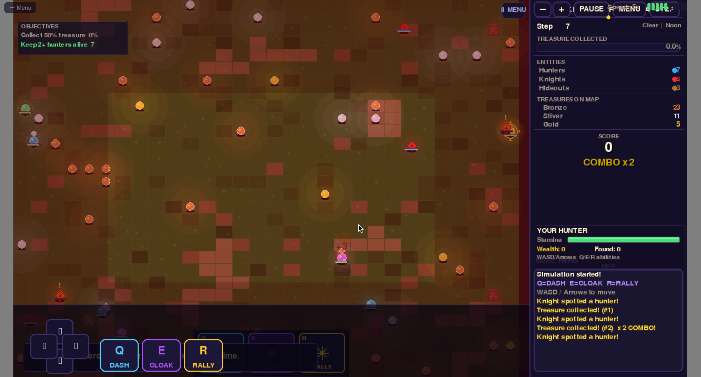

# Knights of Eldoria

A dark fantasy simulation built with Python + Pygame, playable in any browser via WebAssembly.

**[▶ Play Now — fredopoku.github.io/Knights-of-Eldoria-](https://fredopoku.github.io/Knights-of-Eldoria-/)**

---

## Gameplay



*Hero Mode: control your hunter directly, dodge enemy knights, collect treasures and use abilities to survive the waves.*

---

## About

Knights of Eldoria drops you into a living, breathing medieval world. Hunters roam a procedurally animated map collecting scattered treasures while an ever-growing army of knights patrols, chases, and adapts. Choose your role — silent observer, strategic commander, or direct hero — and see how long you can last.

Three game modes, four difficulty tiers, boss knights, wave scaling, and 25 unlockable achievements make every run different.

---

## Game Modes

| Mode | Description |
|------|-------------|
| **Watch** | Sit back and observe autonomous hunters work the map |
| **Command** | Issue waypoints and orders to your squad of hunters |
| **Hero** | Take direct control of a single hero and fight for survival |

---

## Features

- **25 Achievements** — from *First Haul* to *Legendary* completions
- **4 Difficulty Levels** — Easy, Normal, Hard, Legendary
- **Boss Knights** — larger, more aggressive enemies that appear in later waves
- **3 Hero Abilities** — Dash (Q), Cloak (E), Rally (R), each with cooldowns
- **Wave System** — knight count and aggression scale over time
- **Dynamic Weather** — rain and storms affect visibility
- **Day/Night Cycle** — atmospheric tint shifts each run
- **Particle Effects** — sparks, dust, and combat flashes
- **Save System** — 3 save slots with high-score tracking
- **Mobile Ready** — virtual D-pad + ability buttons appear on touch screens
- **PWA Installable** — add to iOS / Android home screen, works offline

---

## Controls

### Keyboard

| Key | Action |
|-----|--------|
| `W` `A` `S` `D` or Arrow Keys | Move |
| `Q` | Dash — burst of speed |
| `E` | Cloak — brief invisibility |
| `R` | Rally — boost nearby allied hunters |
| `ESC` | Pause / Resume |

### Touch / Mobile

A virtual D-pad and three ability buttons appear automatically. Tap anywhere on the canvas once to satisfy the browser's audio interaction requirement, then play normally.

---

## Entity Guide

| Colour | Entity | Role |
|--------|--------|------|
| Blue circle | Hunter — Navigation | Sees farther, finds better paths |
| Green circle | Hunter — Endurance | Lower stamina cost, faster regen |
| Purple circle | Hunter — Stealth | 50 % dodge chance vs knights |
| Gold circle | Your Hero | Player-controlled in Hero Mode |
| Red diamond | Knight | Patrols and chases hunters |
| Dark red ◆ | Boss Knight | Faster, stronger, harder to evade |
| Brown building | Hideout | Hunter rest and treasure deposit |
| Dark building | Garrison | Knight rest and energy recovery |
| Glowing dot | Treasure | Bronze / Silver / Gold |

---

## Scoring

| Treasure | Points |
|----------|--------|
| Bronze | 75 |
| Silver | 150 |
| Gold | 300 |

Collecting consecutive treasures builds a **combo multiplier** shown in the HUD. Letting knights intercept you resets it.

---

## How to Play

1. Open the [Play page](https://fredopoku.github.io/Knights-of-Eldoria-/) and click **PLAY NOW**
2. Choose a **game mode** from the main menu
3. Select **difficulty** — start on Normal
4. In **Hero Mode**: move with WASD, collect glowing treasures, deposit at the brown hideout
5. Use abilities wisely — Dash to escape, Cloak to hide, Rally to regroup hunters
6. Survive waves and unlock achievements as you go

---

## Run Locally (Desktop)

```bash
git clone https://github.com/fredopoku/Knights-of-Eldoria-.git
cd Knights-of-Eldoria-
pip install pygame
python main.py
```

Requires **Python 3.10+** and **Pygame 2.5+**.

### Build for Web

```bash
pip install pygbag
python -m pygbag main.py
# Open http://localhost:8000
```

---

## Tech Stack

| Layer | Technology |
|-------|-----------|
| Language | Python 3.12 |
| Graphics / Game loop | Pygame 2.6.1 |
| Web / WASM | Pygbag 0.9.3 |
| Hosting | GitHub Pages (`/docs` folder) |
| PWA | Web App Manifest + Service Worker |

---

## Project Structure

```
Knights-of-Eldoria-/
├── main.py                  # Async entry point (Pygbag-compatible)
├── src/
│   ├── game.py              # State machine + frame loop
│   ├── simulation.py        # AI, pathfinding, knight waves
│   ├── renderer.py          # All drawing logic
│   ├── ui.py                # Reusable widgets (buttons, bars, panels)
│   ├── audio.py             # SFX + music manager
│   ├── saves.py             # Settings, save slots, achievements
│   ├── particles.py         # Particle system
│   ├── touch_ui.py          # Virtual gamepad for mobile
│   ├── constants.py         # Colours, paths, tuning values
│   └── states/              # Menu, Play, Pause, Settings, Tutorial, …
├── assets/                  # Images, sounds, fonts
└── docs/                    # GitHub Pages deployment
    ├── index.html           # Landing page
    ├── game.html            # Pygbag game shell
    ├── sw.js                # Service worker (offline support)
    └── knights-of-eldoria-.tar.gz  # Packed game archive
```

---

## License

MIT — © 2025 Frederick Opoku Afriyie
